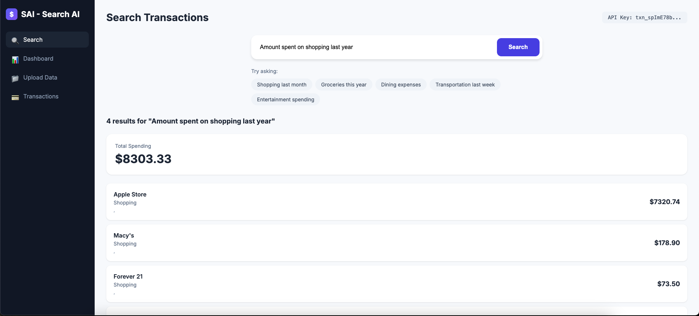

# SAI - Search AI

Intelligent transaction search platform powered by Milvus vector database and semantic search.



## Features

- **Semantic Search**: Search transactions using natural language queries
- **Multi-Tenant**: API key-based isolation for multiple users
- **Auto-Categorization**: Automatic category detection from merchant names
- **Rich Analytics**: Spending summaries, top merchants, category breakdowns
- **Multiple Data Formats**: Supports CSV, Excel (.xlsx), and JSON files
- **Docker Support**: Easy deployment with Docker Compose

## Quick Start with Docker

### Prerequisites

- Docker
- Docker Compose

### Option 1: Full Stack (Recommended)

This starts Milvus + MinIO + App:

```bash
# Start all services
docker-compose up -d

# Check status
docker-compose ps
```

**Services:**
- App: `http://localhost:8001`
- Milvus: `http://localhost:19530`
- MinIO (Milvus storage): `http://localhost:9001`

### Option 2: App Only (Using Existing Milvus)

If you already have Milvus running:

```bash
# Set Milvus URI and start app
export MILVUS_URI=http://localhost:19530
docker-compose up -d app
```

### Option 3: Milvus Lite (No Docker)

For local development without Docker Milvus:

```bash
export MILVUS_DATA_DIR=./data
uvicorn main:app --reload
```

## Upload Transactions (Web UI)

1. Open `http://localhost:8001` in your browser
2. Enter any API key (e.g., `test-key`) in the modal
3. Go to **Upload** tab
4. Drop your CSV/Excel/JSON file
5. Data will be vectorized and stored in Milvus

### Sample CSV Format

```csv
Date,Merchant,Category,Amount
2024-01-15,Amazon,Shopping,99.99
2024-01-16,Starbucks,Food & Dining,5.50
2024-01-17,Uber,Transportation,25.00
```

Supported columns:
- Date: `Date`, `date`, `Transaction Date`
- Merchant: `Merchant`, `merchant`, `Description`
- Category: `Category`, `category` (optional - auto-detected)
- Amount: `Amount`, `amount`, `Value`, `Debit`

## Search Examples

In the web UI search bar, try:

- "shopping last month"
- "How much did I spend on groceries?"
- "Uber rides this year"
- "dining out in January"
- "Entertainment spending"

## Managing Milvus with Docker

### View Milvus Logs

```bash
docker-compose logs -f standalone
```

### View Milvus Data (Attu UI)

Attu is a graphical UI for Milvus:

```bash
docker run -d --name attu \
  -p 8000:3000 \
  -e MILVUS_URL=http://host.docker.internal:19530 \
  zilliz/attu:v2.6
```

Then open `http://localhost:8000`

### Stop All Services

```bash
docker-compose down
```

### Remove All Data

```bash
docker-compose down -v
```

## Environment Variables

| Variable | Default | Description |
|----------|---------|-------------|
| `MILVUS_URI` | `http://127.0.0.1:19530` | Milvus server URL |
| `MILVUS_TOKEN` | - | Zilliz Cloud token (optional) |
| `MILVUS_DATA_DIR` | - | Milvus Lite data directory |

## API Endpoints

| Method | Endpoint | Description |
|--------|----------|-------------|
| POST | `/api/ingest` | Upload transaction file |
| GET | `/api/ingest/status` | Check ingestion status |
| POST | `/api/search` | Semantic search |
| GET | `/api/transactions` | List with filters |
| GET | `/api/summary` | Spending summary |
| GET | `/api/categories` | Available categories |

### Using API with curl

```bash
# Upload file
curl -X POST http://localhost:8001/api/ingest \
  -H "X-API-Key: your-api-key" \
  -F "file=@transactions.csv" \
  -F "clear_existing=true"

# Search
curl -X POST http://localhost:8001/api/search \
  -H "X-API-Key: your-api-key" \
  -H "Content-Type: application/json" \
  -d '{"query": "shopping last month", "limit": 10}'

# Get summary
curl "http://localhost:8001/api/summary" \
  -H "X-API-Key: your-api-key"
```

## Development Setup

```bash
# Clone and install
pip install -r requirements.txt

# Run locally (requires Milvus running)
uvicorn main:app --reload --port 8001
```

## Tech Stack

- **Backend**: FastAPI (Python)
- **Vector DB**: Milvus
- **Embedding Model**: all-MiniLM-L6-v2
- **Frontend**: HTML/CSS/JavaScript (Chart.js)

## License

MIT
